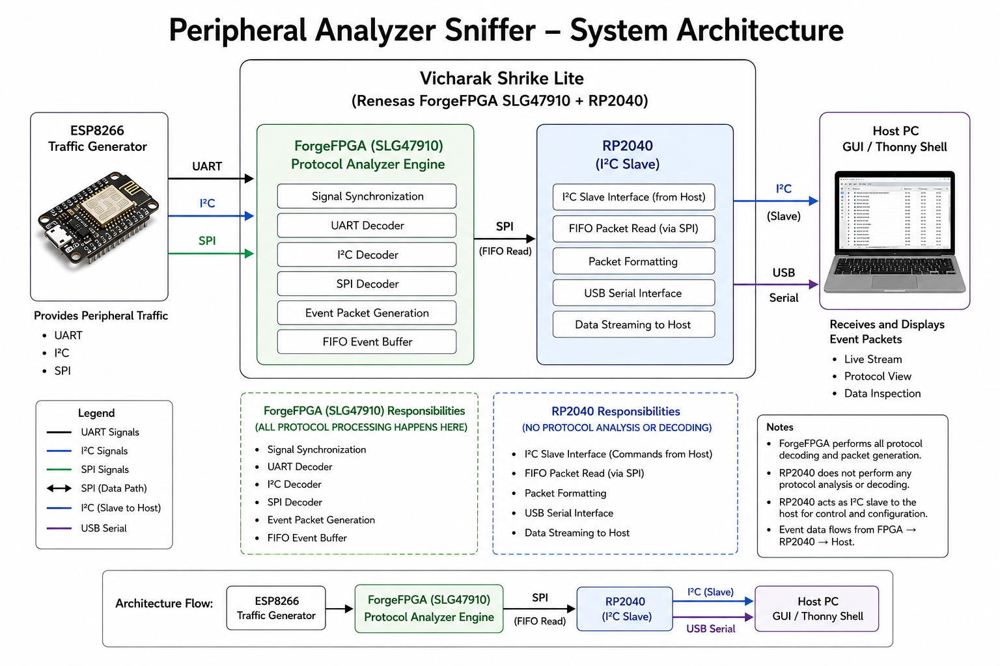

# Peripheral Analyzer Sniffer

- **Difficulty:** Advanced
- **Uses MCU:** Yes
- **External Hardware:** ESP8266 (used only as a test traffic generator — not required for normal operation)

## Overview

This example turns the Shrike board into a hardware logic analyzer for UART, I²C, and SPI. The ForgeFPGA does all the real-time protocol decoding directly in hardware — detecting start bits, START/STOP conditions, and SPI chip-select edges — while the RP2040 forwards the decoded packets to your PC over USB serial. A companion PyQt6 desktop app displays everything live, so you can watch real digital communication happen byte-by-byte instead of just reading about it.

## Features

- UART Protocol Decoding
- I²C Protocol Decoding
- SPI Protocol Decoding
- Hardware Timestamping
- FIFO Event Buffering
- RP2040 USB Bridge
- PyQt6 Desktop GUI
- Real-Time Transaction Display

## Architecture

The following diagram illustrates the complete data flow of the Peripheral Analyzer Sniffer system.

<p align="center">
  
</p>

The ESP8266 is used as a traffic generator during validation. UART, I²C, and SPI signals are monitored by the ForgeFPGA on the Shrike Lite board, decoded in hardware, buffered in FIFO memory, transferred to the RP2040 through SPI, and finally displayed on the host PC through the USB serial interface and Host GUI.

## Demo Video

A complete demonstration of the Peripheral Analyzer Sniffer is available here:

https://drive.google.com/file/d/1y2rRx6_K9lpKxCzvhh-JszVfDGp5awD3/view?usp=sharing

The demo showcases:

- UART protocol decoding
- I²C protocol decoding
- SPI protocol decoding
- FPGA-to-RP2040 communication
- Real-time monitoring using the PyQt6 Host GUI

## Compatibility

| Board | Firmware | Status |
|-------|----------|--------|
| Shrike-Lite (RP2040) | firmware/micropython/ | ✅ Tested on Shrike Lite (RP2040) |
| Shrike (RP2350) | firmware/micropython/ | :white_large_square: Untested |
| Shrike-fi (ESP32-S3) | firmware/arduino-ide/ | :white_large_square: Untested |

The FPGA bitstream is the same across all boards. Only the MCU-side firmware path differs.

## Hardware Setup

No external hardware is required to use the analyzer itself — it passively monitors signals already present on your bus.

If you want to generate test traffic to try the analyzer out (recommended for first-time setup), wire up an ESP8266 as follows:

### UART Monitoring

| ESP8266 Pin | Shrike FPGA Pin | Signal        |
| ----------- | --------------- | ------------- |
| TX          | F7              | `uart_rx`     |
| GND         | GND             | Common Ground |

### I²C Monitoring

| ESP8266 Pin | Shrike FPGA Pin | Signal        |
| ----------- | --------------- | ------------- |
| D1 (GPIO5)  | F9              | `i2c_scl`     |
| D2 (GPIO4)  | F8              | `i2c_sda`     |
| GND         | GND             | Common Ground |

The same I²C bus is also connected to the RP2040 I²C slave interface:

| Signal | RP2040 GPIO |
| ------ | ----------- |
| SDA    | GPIO18      |
| SCL    | GPIO19      |

### SPI Monitoring

| ESP8266 Pin | Shrike FPGA Pin | Signal         |
| ----------- | --------------- | -------------- |
| D5 (GPIO14) | F10             | `spi_mon_sclk` |
| D8 (GPIO15) | F11             | `spi_mon_cs_n` |
| D7 (GPIO13) | F13             | `spi_mon_mosi` |
| D6 (GPIO12) | F14             | `spi_mon_miso` |
| GND         | GND             | Common Ground  |

> **Note:** These pin assignments were used during development and validation of this example on the Shrike Lite platform. The monitored signals can be mapped to different FPGA pins if desired by updating the FPGA I/O Planner in GCSH and firmware accordingly.

The ESP8266 was used only as a traffic generator for testing. Any device generating UART, I²C, or SPI traffic can be monitored by the analyzer.

> **Important:** The analyzer's monitoring inputs are passive (high-impedance reads). Always share a common ground between the Shrike board and whatever bus you're sniffing.

## Quick Start (Pre-Built Bitstream)

1. Connect your Shrike board to your PC via USB.
2. Upload `bitstream/peripheral_analyzer_sniffer.bin` to the FPGA using ShrikeFlash (via Thonny/MicroPython — see `firmware/micropython/`).
3. Install the host app dependencies and launch the GUI.
4. Generate some UART, I²C, or SPI traffic on the monitored lines.
5. **Expected result:** decoded packets appear in the GUI in real time, color-coded by protocol, with timestamps and byte-level detail.
6. For basic verification, decoded packets can also be viewed directly in the Thonny Shell output.
7. If the host GUI is unavailable or encounters issues, the Thonny Shell provides a reliable fallback interface for validating protocol decoding and FPGA operation.

## Build From Source

### FPGA (Verilog)

1. Open `peripheral_analyzer_sniffer.ffpga` in Go Configure Software Hub (GCSH).
2. Verify I/O pin assignments in the IO Planner against your board variant.
3. Click **Synthesize** → review resource/LUT utilization.
4. Run **Place & Route (PnR)**.
5. Click **Generate Bitstream**.
6. Output will be in `ffpga/build/` — copy the resulting `.bin` into `bitstream/` (as `peripheral_analyzer_sniffer.bin`) if you want to refresh the pre-built copy.

### Firmware (MicroPython — primary path)

1. Open Thonny IDE and connect to your Shrike board.
2. Copy `bitstream/peripheral_analyzer_sniffer.bin` to the board's filesystem.
3. Upload `firmware/micropython/decoder.py`.
4. Run it — it programs the FPGA and starts forwarding decoded packets over USB serial.

## Host GUI Download

The pre-built Windows GUI is available from the GitHub Releases page.

GitHub Releases:
https://github.com/upadhyaypranjal/FPGA-based-Multi-Protocol-Analyzer-Sniffer/releases

Download:

- `Executable.zip`

Extract it and run:

- `main.exe`

### Connecting to the Analyzer

1. Connect the Shrike Lite board to the host PC using USB.
2. Ensure the protocol analyzer firmware is running on the RP2040.
3. Open the GUI application.
4. Select the appropriate COM port from the drop-down menu.
5. Click **Connect**.

Once connected, the GUI will automatically begin receiving decoded protocol packets from the analyzer.

### Expected Operation

After a successful connection:

1. Generate UART, I²C, or SPI traffic using external hardware or the provided ESP8266 test generators.
2. Decoded packets will appear automatically in the GUI.
3. Protocol events are categorized and displayed in real time.

### GUI Examples

<p align="center">
  
</p>

<p align="center">
  
</p>

<p align="center">
  
</p>

### Alternative: Thonny Shell Monitoring

Although the recommended interface is the PyQt6 Host GUI, decoded protocol packets can also be monitored directly through the Thonny Shell.

After running the MicroPython firmware:

1. Open Thonny IDE.
2. Connect to the Shrike board.
3. Run the analyzer firmware.
4. Observe decoded UART, I²C, and SPI events in the Shell window.

## Generating Test Traffic

To demonstrate and validate the analyzer, an ESP8266 NodeMCU was used as a protocol traffic generator during development.

### UART Traffic Generation

UART traffic is generated directly through the ESP8266 USB serial interface. Since PuTTY acts as a serial terminal, any text entered by the user is transmitted as UART data and can be monitored immediately by the analyzer.

```text
User → PuTTY → ESP8266 UART TX → FPGA UART Decoder
```

---

### I²C Traffic Generation

For I²C testing, the ESP8266 firmware receives user input from PuTTY and converts each typed character into I²C transactions addressed to the target device.

```text
User → PuTTY → ESP8266 → I²C Bus → FPGA I²C Decoder
```

This allows arbitrary user-defined messages to be transmitted over I²C without modifying the firmware.

---

### SPI Traffic Generation

For SPI testing, the ESP8266 firmware receives user input from PuTTY and transmits the entered characters over the SPI bus. The FPGA monitors the SPI signals and reconstructs the transmitted transaction.

```text
User → PuTTY → ESP8266 → SPI Bus → FPGA SPI Decoder
```

As with I²C testing, any message entered in PuTTY can be converted into SPI traffic and observed by the analyzer in real time.

---

### Why PuTTY Is Used

PuTTY provides a simple way to generate custom test traffic without recompiling firmware for every experiment.

- UART: User input is transmitted directly as UART data.
- I²C: User input is converted into I²C transactions by the ESP8266 firmware.
- SPI: User input is converted into SPI transactions by the ESP8266 firmware.

This approach makes it possible to test the analyzer using arbitrary messages and protocol activity while keeping the traffic-generation firmware simple and reusable.

## How It Works

The FPGA does all protocol decoding in hardware, deterministically, rather than relying on software polling that could miss fast transitions.

- **Synchronization:** Incoming UART, I²C, and SPI lines are asynchronous to the FPGA's internal clock, so each is first passed through a synchronizer to avoid metastability before any logic touches it.
- **UART decoding:** A start-bit detector watches the RX line for the falling edge that begins a frame, then samples at the configured baud rate to reconstruct each byte.
- **I²C decoding:** Dedicated logic watches SDA relative to SCL to catch START and STOP conditions, then decodes address and data bytes along with their ACK/NACK bit.
- **SPI decoding:** The SPI sniffer logic tracks the chip-select line to frame each transaction, then shifts in MOSI/MISO bits on the appropriate clock edge to reconstruct each transferred byte.
- **Packetization & buffering:** Decoded bytes from all three protocols are wrapped into small event packets and pushed into a FIFO, so bursts of traffic don't get dropped while the RP2040 catches up.
- **SPI bridge to RP2040:** The RP2040 polls the FPGA over SPI, pulls packets out of the FIFO, and forwards them over USB serial.
- **Host display:** The RP2040 firmware is a thin bridge — all the real decoding already happened in the FPGA. The PyQt6 app on your PC just parses incoming serial packets and renders them.

This split matters: software-only sniffers can miss events while busy doing other work, but the FPGA samples every clock edge regardless of what the RP2040 or PC is doing.

## Expected Output

When everything is wired and running correctly, the GUI displays decoded protocol transactions in real time.

### UART Example

```text
PROTOCOL DETECTED : UART

17:11:49    UART    MESSAGE    electronics and communication
```

### I²C Example

```text
PROTOCOL DETECTED : I2C

▶ I2C TRANSACTION #7

17:05:35    I2C    START    Bus Start
17:05:35    I2C    ADDR     0x48 (WRITE) ACK
17:05:35    I2C    DATA     0x6F ACK
17:05:35    I2C    STOP     Bus Stop
```

### SPI Example

```text
PROTOCOL DETECTED : SPI

▶ SPI TRANSACTION #1

17:24:22    SPI    START
17:24:22    SPI    BYTES    23
17:24:22    SPI    MOSI     63 72 65 64 69 62 69 6C 69 74 79 20 61 6E 64 20 73 65 72 76 69 63 65
17:24:22    SPI    MISO     FF FF FF FF FF FF FF FF FF FF FF FF FF FF FF FF FF FF FF FF FF FF FF
17:24:22    SPI    STOP
```

The GUI automatically groups protocol events into transactions, displays decoded protocol fields, and provides real-time monitoring of UART, I²C, and SPI communication activity.

## Future Improvements

- Automatic UART baud-rate detection
- Support for SPI mode (CPOL/CPHA) auto-detection
