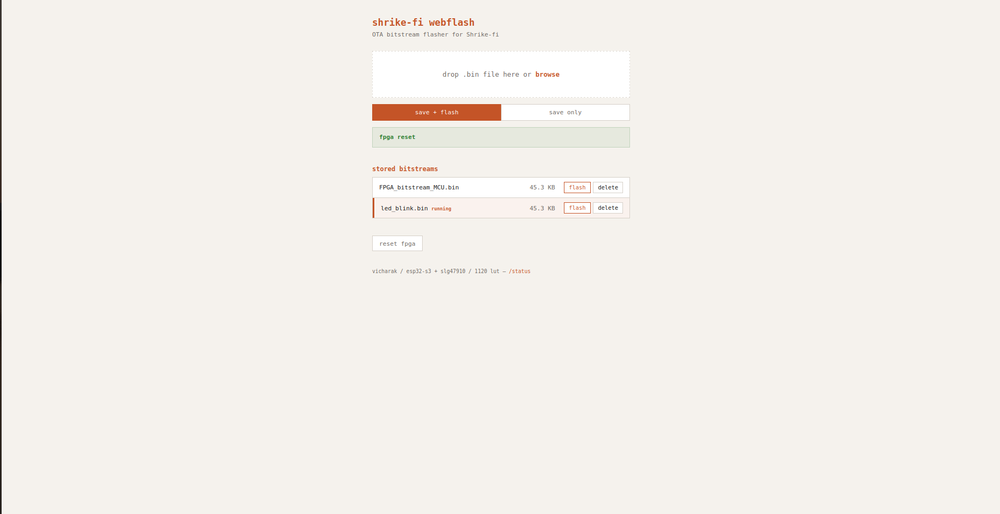

# Shrike-fi WebFlash

OTA FPGA bitstream flasher for the Shrike-fi board.
Drag and drop `.bin` files from your browser to flash the SLG47910 ForgeFPGA over Wi-Fi.

**Hardware:** Shrike-fi
**Stack:** MicroPython + raw HTTP server + vanilla HTML/JS

## Features

- Drag-and-drop bitstream upload with save + flash or save only modes
- Persistent bitstream storage — upload once, flash anytime from the file list
- Auto-flash on boot — last flashed bitstream is restored on power-up
- Active bitstream indicator in the web UI
- FPGA reset from the browser
- Station mode (join existing Wi-Fi) with AP mode fallback


## User Interface 

<div align="center">

 

</div>

## Quick Start

```bash
mpremote cp main.py :main.py
mpremote cp index.html :index.html
mpremote reset
```

Connect to the `Shrike-fi` Wi-Fi (password: `vicharak123`), open `http://192.168.4.1`.

## Station Mode

To join an existing network instead of creating an AP, edit `main.py`:

```python
STA_SSID = "YourWiFi"
STA_PASSWORD = "YourPassword"
```

The board tries station mode first (10s timeout), falls back to AP if it fails.
With `STA_SSID = ""` (default), it goes straight to AP mode.

## API

```
GET  /                  Web UI
GET  /files             List stored bitstreams + active indicator (JSON)
GET  /status            Board info, free memory (JSON)
POST /flash             Upload + flash bitstream (octet-stream, X-Filename header)
POST /upload            Upload without flashing
POST /flash/<name>      Flash a stored bitstream
POST /reset             Reset the FPGA
DELETE /files/<name>    Delete a stored bitstream
```

## Files

```
main.py           MicroPython firmware — web server + flash logic
index.html        Drag-and-drop web UI
last_flashed.txt  Auto-generated — tracks the active bitstream
```


## Configuration

All config is at the top of `main.py`:

```
STA_SSID / STA_PASSWORD   Station mode Wi-Fi credentials
STA_TIMEOUT               Connection timeout (default: 10s)
AP_SSID / AP_PASSWORD     AP mode credentials (default: Shrike-fi / vicharak123)
MAX_BITSTREAM_SIZE        Upload size limit (default: 48 KB)
```

## Dependencies

- MicroPython v1.23+ on ESP32-S3 ( use the shrike-fi micropython from the release page)
- `shrike` module (provides `shrike.flash()` and `shrike.reset()`)
